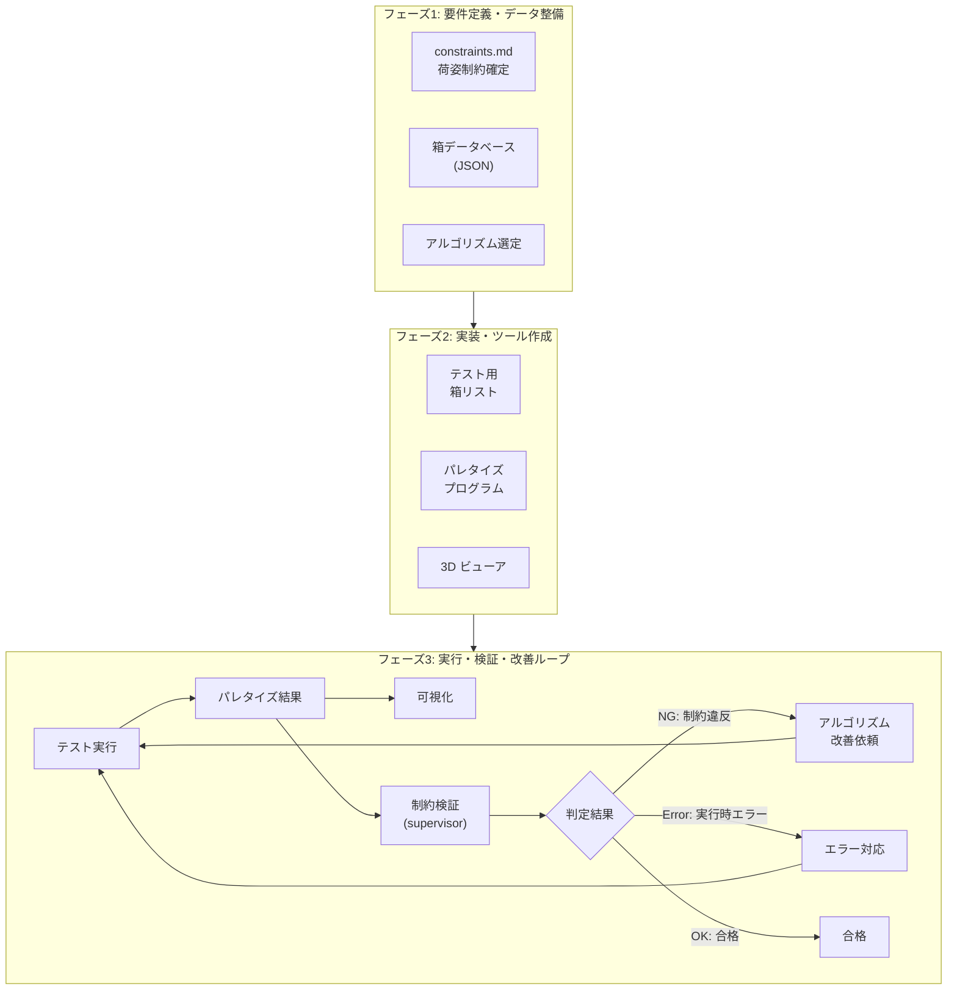

# GitHub Copilot グローバル指示書

このドキュメントは、パレタイズアルゴリズム試作プロジェクト全体に対して GitHub Copilot が常時適用すべき開発規約、制約、ループエンジニアリング手順、およびコーディング規約を定義する。

---

## 1. プロジェクト概要

### 1.1 目的
AIマルチエージェントを活用して、箱パレタイズ（嵌合・リブ付き空箱のパレタイズ）アルゴリズムおよび評価基盤を開発する。

### 1.2 対象領域
- **空箱パレタイズ**: 重量パラメータは不要。寸法・形状のみを対象。
- **TP規格コンテナ**: モジュール化された嵌合・リブ構造を有する通い箱。
- **非TP規格箱**: 単一型番のみによるコラム積み。

---

## 2. パレット・積載領域仕様

| 項目 | 値 | 備考 |
| :--- | :--- | :--- |
| **パレット寸法 (W × L)** | 1200 mm × 1000 mm | 長辺: 1200 mm, 短辺: 1000 mm |
| **最大積載高さ** | **1200 mm** | パレット上面からの総高さ上限 |
| **長辺方向オーバーハング** | **< 1360 mm** | パレット長辺方向の荷姿許容幅 |
| **短辺方向オーバーハング** | **800 mm ≤ 幅 < 1100 mm** | パレット短辺方向の荷姿許容幅（安定性確保のため最小800mm以上） |
| **箱間クリアランス** | **0 mm** | 箱同士は密着配置 |

---

## 3. 共通データ仕様

### 3.1 箱データベース仕様 (box_db)
各箱エントリの必須フィールド:
- `id` (string): 箱の識別子 / 型番
- `name` (string): 日本語名称 / シリーズ名
- `type` (string): "TP" または "NON_TP"
- `width` (float): 外寸幅 [mm]
- `length` (float): 外寸奥行き [mm]
- `height` (float): 外寸高さ [mm]
- `fitting_depth` (float): 上下に積み重ねたときの勘合（はまり込み）深さ [mm]
- `rib_thickness` (float): 外周リブや底面リブの厚み [mm]
- `module_ratio` (string, TP規格のみ): TP規格のモジュール比率（例: "1x1", "2x1"）

### 3.2 パレット仕様 (pallet_spec)
- `width` (float): パレット幅 = 1200 [mm]
- `length` (float): パレット奥行き = 1000 [mm]
- `max_height` (float): 最大積載高さ = 1200 [mm]

### 3.3 パレタイズ結果データ仕様 (palletize_result)
配置される各箱のリスト（JSON配列）。各エントリ:
- `order` (int): 積み込み順番（1, 2, 3, ...）
- `box_id` (string): 配置対象の箱ID
- `position` (object): 配置座標 `{x: float, y: float, z: float}` [mm]
- `rotation` (int): 箱の回転向き（0 または 90）[度]

**例**:
```json
{
  "test_name": "single_tp131",
  "pallet": {"width": 1200, "length": 1000, "max_height": 1200},
  "result": [
    {"order": 1, "box_id": "TP-131", "position": {"x": 0, "y": 0, "z": 0}, "rotation": 0}
  ]
}
```

---

## 4. 荷姿制約詳細

### 4.1 箱の配置・回転制約

1. **天地（上下）固定**
   - 箱の上下反転、横倒し配置は禁止。
   - 常に上面が上を向くように配置する。

2. **回転角度**
   - 水平方向（Z軸回り）の回転は **0度** または **90度** のみ許可。

### 4.2 嵌合（かんごう）・段積みルール

#### (1) TP規格箱の段積み・嵌合
- **モジュール嵌合**:
  - TP規格箱は底面リブ・フチ形状がモジュール化。
  - 同一型番はもちろん、モジュール倍数関係にある箱（例: TP-330系 2個の上に TP-460系 1個）の嵌合段積みが可能。
  - TP規格箱同士の組み合わせ段積みルールに準拠する。

- **嵌合高さの計算**:
  - 下段の箱の上に箱を積み重ねる際、`fitting_depth` 分だけ沈み込む。
  - 上段箱の底面Z座標 = `下段箱の上面Z座標 - fitting_depth`

#### (2) 非TP規格箱（その他箱）の段積み
- **コラム積み（同一フットプリント）限定**:
  - 非TP規格箱は、同一型番（同一フットプリント寸法）の箱同士のみ直上に積み重ね可能。
  - 異なる寸法の箱の上に乗せること、または異なる箱を下に乗せることは禁止。

#### (3) 支持・安定性制約
- **空中配置の禁止**:
  - すべての箱は、底面が「パレット上面」または「適切な下段の箱の上面」によって確実に支持されなければならない。

- **リブ干渉の回避**:
  - リブ厚み（`rib_thickness`）による干渉・浮き上がりが生じない配置とする。

### 4.3 積載順序（積み込み手順）の制約

- **下段優先・物理的整合性**:
  - 積み込み順序 `order`（1, 2, 3, ...）は、実際にロボットや作業者が配置可能な順序であること。
  - 原則として下段の箱が配置された後に、その上段の箱が配置されること。
  - 後から配置する箱が、既に配置された箱と空間的に干渉・衝突しない順序であること。

### 4.4 荷姿安定性・最高層四隅高さ一致制約 (Top 4-Corner Leveling)

- **最高層の四隅高さのフラット化**:
  - ストレッチフィルム包装やバンド掛け、多段パレット積み時の安定性を確保するため、荷山全体の**最高層（最上面）において、荷姿の四隅（4つのコーナー）に位置する箱の上面高さ（Top Z）を一致（均一化）**させること。
  
  - 四隅の定義:
    1. **左手前コーナー**: $(X_{min}, Y_{min})$
    2. **右手前コーナー**: $(X_{max}, Y_{min})$
    3. **左奥コーナー**: $(X_{min}, Y_{max})$
    4. **右奥コーナー**: $(X_{max}, Y_{max})$
  
  - これら4つのコーナーをカバーする最上段の箱の上面高さが、荷山の最高到達高さ $Z_{max}$ と同一（誤差 1.0mm 以内）であること。

---

## 5. 制約検証チェック項目一覧

以下の項目は **supervisor** が厳格に検証する。すべてをPASSとする必要がある。

| # | チェック項目 | 合格基準 (PASS) | NG対応 |
| :--- | :--- | :--- | :--- |
| 1 | **積載全高** | 全ての箱の最高Z座標 ≤ 1200 mm | 超過箱の除外または段数削減 |
| 2 | **長辺寸法** | 荷姿全体の長辺方向幅 < 1360 mm | 長辺はみ出し超過の是正 |
| 3 | **短辺寸法** | 800 mm ≤ 荷姿全体の短辺方向幅 < 1100 mm | 短辺はみ出しまたは不足の是正 |
| 4 | **最高層四隅高さ** | 荷姿の4つのコーナーの最上段箱の上面高さが $Z_{max}$ と一致（±1.0mm） | 四隅タワーの高さレベリング |
| 5 | **重なり・干渉** | 嵌合深さを除き、箱同士の3Dモデルが干渉（貫通）していないこと | 配置座標の修正 |
| 6 | **嵌合・段積み整合性** | TP規格モジュール嵌合または同箱コラム積みのルールを満たしていること | 段積み組み合わせの修正 |
| 7 | **支持面チェック** | 底面積の85%以上がパレットまたは下段箱に支持されていること（空中浮きなし） | 配置位置・順序の修正 |
| 8 | **回転角** | 回転角が 0度 または 90度 のみであること | 回転角度の是正 |
| 9 | **積み順** | 支持関係にある箱について $order_{lower} < order_{upper}$ の整合性を満たすこと | `order` のソート/再計算 |

---

## 6. ループエンジニアリング実行プロトコル

### 6.1 3段階フェーズ構成



### 6.2 各フェーズの推進方法

#### **フェーズ1: 要件定義・データ整備** (初回・仕様変更時)
1. **constraints.md の確定**: ユーザーと対話し、荷姿制約を完全に決定。
2. **箱DB作成**: TP規格コンテナ等の仕様を調査し、`box_research/box_db.json` に登録。
3. **アルゴリズム方式選定**: パレタイズ手法（レイヤー構築、ギロチンカット等）を提案・選定。

#### **フェーズ2: 実装・ツール作成**
1. **テスト用箱リスト作成**: 単載・混載・境界値テストケースを `test_programmer/test_cases/` に生成。
2. **アルゴリズム実装**: `algorithm_programmer/palletizer.py` にパレタイズエンジンを実装。
3. **可視化ツール開発**: `visualizer/` に3D/2D可視化ビューアを作成。

#### **フェーズ3: 実行・検証・改善ループ** (反復)
**以下のサイクルを合格まで繰り返す:**

1. **テスト実行**: `tester/run_simulation.py` ですべてのテストケースを実行。
   - 入力: `test_programmer/test_cases/` 配下のテストケースJSON群
   - 出力: `tester/results/result_*.json`（パレタイズ結果）

2. **可視化**: `visualizer/visualize.py` で結果を3D表示・確認。

3. **制約検証**: `supervisor/validate.py` で結果を制約チェック。
   - 入力: `tester/results/result_*.json`, `constraints/constraints.md`, `box_research/box_db.json`
   - 出力: `supervisor/reports/` 配下の検証レポート

4. **判定分岐**:
   - **OK（PASS）**: 該当テストケースの合格。次ケースへ移行。
   - **NG（制約違反）**: `supervisor/validation_summary.md` で具体的な違反内容を確認。
   - **Error（実行時エラー）**: スタックトレース確認。

5. **改善**: NG / Error の場合、フィードバック内容を `algorithm-programmer` に報告し、`algorithm_programmer/palletizer.py` を修正・改善。

6. **再実行**: ステップ1から繰り返す。

### 6.3 各エージェント角色の責任と依存関係

| エージェント | 責務 | 参照ファイル | 出力ファイル |
| :--- | :--- | :--- | :--- |
| **orchestrator** | 全体進行管理・フェーズ計画・エージェント統括 | GEMINI.md, constraints.md | (統括指示) |
| **box-research** | 箱仕様調査・DB化 | constraints.md | box_research/box_db.json |
| **algorithm-research** | アルゴリズム方式調査・提案 | constraints.md, box_db.json | algorithm_research/proposal.md |
| **test-programmer** | テストケース生成 | constraints.md, box_db.json | test_programmer/test_cases/*.json |
| **algorithm-programmer** | パレタイズエンジン実装・改良 | constraints.md, box_db.json, proposal.md | algorithm_programmer/palletizer.py |
| **tester** | テスト実行・結果収集 | test_cases/*.json, palletizer.py | tester/results/result_*.json |
| **visualizer** | 結果可視化ツール | box_db.json, results/*.json | visualizer/*.html |
| **supervisor** | 制約検証・品質監視 | constraints.md, box_db.json, results/*.json | supervisor/reports/*, validation_summary.md |

---

## 7. コーディング規約

### 7.1 Python コード規約
- **言語**: Python 3.8 以上
- **命名規約**:
  - 関数・変数: `snake_case` (例: `palletize_algorithm`, `box_list`)
  - クラス: `PascalCase` (例: `PalletizationEngine`, `BoxModel`)
  - 定数: `UPPER_SNAKE_CASE` (例: `MAX_HEIGHT`, `PALLET_WIDTH`)
- **ドキュメンテーション**:
  - 関数・メソッドに docstring（Google形式推奨）を記載
  - 複雑な処理にはインラインコメント
- **型ヒント**: 可能な限り型ヒント（type hints）を付与
- **テスト**: テストは `*_test.py` ファイル名で同ディレクトリに配置

### 7.2 JSON / データファイル規約
- **フォーマット**: UTF-8, 4スペースインデント
- **構造**: 本ドキュメント 3.1～3.3 の仕様に厳格に従う
- **検証**: JSON Schema による自動検証スクリプト化推奨

### 7.3 ドキュメント規約
- **言語**: 日本語（一部英数字・記号含む）
- **フォーマット**: Markdown (.md)
- **見出し**: # で階層分け、## で主要セクション

### 7.4 ファイル配置規約
- 各エージェントが生成するファイルは、担当ディレクトリ内に配置
- 共通参照ファイル（constraints.md, box_db.json等）はプロジェクトルートまたは指定ディレクトリに配置
- .github/prompts/ 配下に各ロール別プロンプトを配置

---

## 8. 重要事項・禁止事項

### 8.1 禁止事項
- **既存コードの破壊的変更**: .agent/, constraints/ 配下の既存定義ファイルを無断で削除・変更しない
- **資産の喪失**: test_programmer/, tester/, visualizer/, supervisor/ 配下の既存Pythonスクリプト・テストデータを破壊しない
- **データ形式の変更**: JSON仕様（box_db.json, palletize_result等）を独断で変更しない

### 8.2 推奨事項
- **段階的改善**: 機能追加・修正は小刻みに行い、各段階で動作確認
- **ユーザー合意**: 仕様の大幅変更やリスク高い判断はユーザーと対話
- **可視化**: 荷姿結果は必ず3D可視化で検証
- **ログ記録**: テスト実行・制約検証のログは詳細に記録

### 8.3 クリティカル制約
- **制約検証の厳格性**: supervisor は 9 つのチェック項目すべてに対して PASS/NG を明確に判定
- **積載高さ上限の遵守**: 1200 mm を超える荷姿は絶対に許可しない
- **安定性確保**: 最高層四隅高さ一致制約は必ず実装し、フィルム包装時の安定性を確保

---

## 9. 外部リソース・参照ファイル

- **GEMINI.md**: プロジェクト全体ルール・エージェント役割定義
- **constraints/constraints.md**: 荷姿制約仕様書（詳細版）
- **.agent/*.yaml**: 各エージェント設定ファイル群
- **.github/prompts/*.prompt.md**: Copilot Chat 用ロール別プロンプト（本ファイルと併用）

---

## 10. Copilot との相互作用

### 10.1 プロンプト利用方法
Copilot Chat で特定ロールの作業を指示する際は、`.github/prompts/` 配下の対応プロンプトを参照・引用する：

```
# orchestrator.prompt.md に基づき、以下のタスクを実行してください：
[特定のタスク説明]
```

### 10.2 応答方式
- Copilot は必ず日本語で応答する
- エラー・不明な点は直ちに報告し、ユーザー（orchestrator）の指示を仰ぐ
- 技術的判断が必要な場合は複数の選択肢を提示し、判断を委ねる

### 10.3 ステップバイステップ実行
複雑な作業は以下の流れで段階的に実行：

1. **現状確認**: 対象ファイル・データの状態を把握
2. **計画提示**: 実行予定の作業工程を提示・確認
3. **実行**: 各ステップを実行し、結果を確認
4. **検証**: 成果物が仕様に適合しているか確認
5. **報告**: 完了・課題をユーザーに報告

---

**バージョン**: 1.0  
**作成日**: 2026-09-20  
**最終更新**: 2026-09-20
