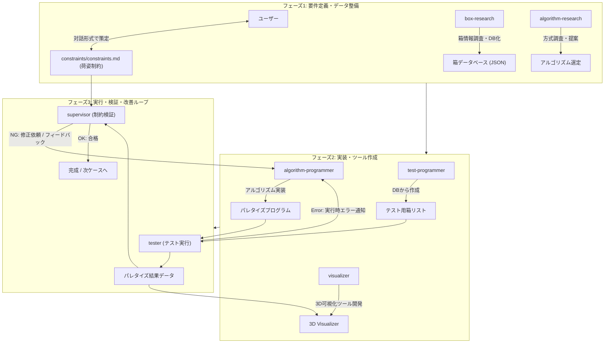

# パレタイズアルゴリズム試作

このプロジェクトは、AIマルチエージェントを活用して箱パレタイズ（嵌合・リブ付き空箱のパレタイズ）アルゴリズムおよび評価基盤を開発する。

---

## 1. エージェント構成と役割

- **`orchestrator`**
  - 他サブエージェントを統括する管理者。
  - ユーザーからの要望に応じて計画を立案し、各サブエージェントに作業指示を行い、プロジェクト全体の進行と整合性を管理する。

- **`box-research`**
  - パレタイズ対象となる箱（通い箱・オリコン等）の寸法・嵌合深さ・リブ仕様などを調査し、データベース化する。

- **`algorithm-research`**
  - 嵌合やリブ構造を考慮した箱パレタイズアルゴリズムに関して情報を検索・調査し、本プロジェクトに適した方式を提案する。

- **`test-programmer`**
  - `box-research` がデータベース化した箱情報をもとに、テスト・評価用の箱リスト（単載・混載等の投入パターン）を作成する。

- **`algorithm-programmer`**
  - `algorithm-research` が提案した方式に基づきパレタイズアルゴリズムを実装する。
  - `supervisor` や `tester` からのフィードバックをもとにプログラムの改良を行う。

- **`visualizer`**
  - アルゴリズムが出力したパレタイズ結果（配置座標、回転、積み順）を3D/2Dで描画・可視化するツールを開発・提供する。

- **`tester`**
  - `test-programmer` が作成した箱リストを入力として `algorithm-programmer` のプログラムを実行し、荷山形成シミュレーションを行う。
  - エラーや例外発生時はエラー内容をプログラマにフィードバックする。

- **`supervisor`**
  - `constraints/constraints.md`（荷姿制約）に基づき、出力された荷姿や積み順が制約を満たしているかを監視・検証する。
  - 制約違反がある場合は、具体的な問題点とともにプログラムの修正を依頼する。

---

## 2. 共通データ仕様

※空箱を前提とするため重量パラメータは扱いません。

### (1) 箱データベース仕様 (`box_db`)
- `id` (string): 箱の識別子 / 型番
- `width` (float): 外寸幅 [mm]
- `length` (float): 外寸奥行き [mm]
- `height` (float): 外寸高さ [mm]
- `fitting_depth` (float): 上下に積み重ねたときの勘合（はまり込み）深さ [mm]
- `rib_thickness` (float): 外周リブや底面リブの厚み [mm]

### (2) パレット仕様 (`pallet_spec`)
- `width` (float): パレット幅 [mm]
- `length` (float): パレット奥行き [mm]
- `max_height` (float): 最大積載高さ（パレット上面からの高さ） [mm]

### (3) パレタイズ結果データ仕様 (`palletize_result`)
配置される各箱のリスト：
- `order` (int): 積み込み順番（1, 2, 3, ...）
- `box_id` (string): 配置対象の箱ID
- `position`: 配置座標 `(x, y, z)` [mm]
- `rotation`: 箱の回転向き `r` (例: 0度, 90度)

---

## 3. 荷姿制約 (`constraints/constraints.md`) の作成方針

- 荷姿制約はプロジェクトルートに `constraints/constraints.md` として独立して管理する。
- 嵌合ルール、リブ干渉、はみ出し許容、段積みパターンの制約などは、**ユーザーと対話形式でヒアリングしながら決定・作成**する。

---

## 4. エージェント実行フロー



1. **フェーズ1: 要件定義・データ整備**
   - ユーザーとの対話により `constraints/constraints.md`（荷姿制約）を作成・確定。
   - `box-research` が箱仕様（嵌合深さ・リブ厚み含む）を調査し、箱DBを作成。
   - `algorithm-research` が嵌合箱に対応可能なパレタイズ手法を調査・提案。

2. **フェーズ2: 実装・ツール作成**
   - `test-programmer` がテストケース（箱投入リスト）を作成。
   - `algorithm-programmer` がパレタイズエンジンを実装。
   - `visualizer` が荷姿と積み順を3D/2Dで直感的に確認できる可視化ツールを作成。

3. **フェーズ3: 実行・検証・改善ループ**
   - `tester` がテスト箱リストでアルゴリズムを実行し、結果データを生成。
   - `visualizer` で荷姿を可視化。
   - `supervisor` が `constraints/constraints.md` をもとに制約違反がないかを厳格にチェック。
   - NGまたは実行時エラーの場合は `algorithm-programmer` に改善フィードバックを返し、合格するまでループ。

---

## 5. ディレクトリ・アーティファクト構成

各サブエージェントが生成・管理する成果物（アーティファクト、コード、データ）は、以下のディレクトリに分離して管理する。

```text
palletizing_prototype/
├── GEMINI.md                  # プロジェクト構成・全体ルール
├── .agent/                    # サブエージェント設定ファイル定義
├── constraints/               # 荷姿制約仕様書 (constraints.md)
├── box_research/              # 【box-research】箱仕様調査レポート、box_db.json
├── algorithm_research/        # 【algorithm-research】アルゴリズム調査・方式提案書
├── test_programmer/           # 【test-programmer】テストデータ生成スクリプト、テスト箱リスト
├── algorithm_programmer/      # 【algorithm-programmer】パレタイズアルゴリズム実装モジュール
├── visualizer/                # 【visualizer】3D/2D可視化ツール、描画ビューワ
├── tester/                    # 【tester】テスト実行スクリプト、シミュレーション結果データ、ログ
└── supervisor/                # 【supervisor】制約バリデーションスクリプト、検証レポート
```


