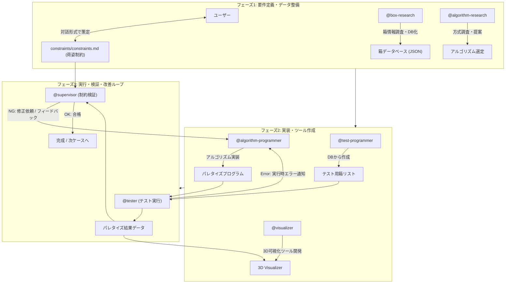

# パレタイズアルゴリズム試作 (GitHub Copilot 版)

> **プロジェクト移行**: Antigravity 2.0 → GitHub Copilot
> 
> このプロジェクトは、GitHub Copilot を活用したループエンジニアリングで箱パレタイズ（嵌合・リブ付き空箱のパレタイズ）アルゴリズムおよび評価基盤を開発する。

---

## 1. GitHub Copilot エージェント構成と役割

以下の8ロールでループエンジニアリングを実行します。各ロールのサブエージェント定義は `.github/agents/` ディレクトリに `*.agent.md` として格納されており、GitHub Copilot CLI から `/agent <name>` または `@<name>` で直接呼び出せます。

- **`orchestrator`** (`.github/agents/orchestrator.agent.md`)
  - 全体進行管理。ユーザーからの要望に応じて計画を立案し、作業指示を行い、プロジェクト全体の進行と整合性を管理する。

- **`box-research`** (`.github/agents/box-research.agent.md`)
  - パレタイズ対象となる箱（通い箱・オリコン等）の寸法・嵌合深さ・リブ仕様などを調査し、データベース化する。

- **`algorithm-research`** (`.github/agents/algorithm-research.agent.md`)
  - 嵌合やリブ構造を考慮した箱パレタイズアルゴリズムに関して情報を検索・調査し、本プロジェクトに適した方式を提案する。

- **`test-programmer`** (`.github/agents/test-programmer.agent.md`)
  - `box-research` がデータベース化した箱情報をもとに、テスト・評価用の箱リスト（単載・混載等の投入パターン）を作成する。

- **`algorithm-programmer`** (`.github/agents/algorithm-programmer.agent.md`)
  - `algorithm-research` が提案した方式に基づきパレタイズアルゴリズムを実装する。
  - `supervisor` や `tester` からのフィードバックをもとにプログラムの改良を行う。

- **`visualizer`** (`.github/agents/visualizer.agent.md`)
  - アルゴリズムが出力したパレタイズ結果（配置座標、回転、積み順）を3D/2Dで描画・可視化するツールを開発・提供する。

- **`tester`** (`.github/agents/tester.agent.md`)
  - `test-programmer` が作成した箱リストを入力として `algorithm-programmer` のプログラムを実行し、荷山形成シミュレーションを行う。
  - エラーや例外発生時はエラー内容をプログラマにフィードバックする。

- **`supervisor`** (`.github/agents/supervisor.agent.md`)
  - `constraints/constraints.md`（荷姿制約）に基づき、出力された荷姿や積み順が制約を満たしているかを監視・検証する。
  - 制約違反がある場合は、具体的な問題点とともにプログラムの修正を依頼する。

### 1.1 役割定義ファイルの3系統について

本リポジトリには目的の異なる3種類のロール定義ファイル群があり、混同しないよう役割を整理する。

| ディレクトリ | 位置づけ | 読み込まれ方 |
|---|---|---|
| **`.github/agents/*.agent.md`** | **サブエージェント定義（正）**。各ロールの詳細な行動指針を保持する | GitHub Copilot CLI から `/agent <name>` や `@<name>` で明示的に呼び出す |
| `.github/instructions/*.instructions.md` | 各ロールの要約版。常時参照させたい要点のみを保持する | GitHub Copilot CLI/VS Code に**常時自動読込**される（呼び出し不要） |
| `.github/prompts/*.prompt.md` | VS Code Copilot Chat 用スラッシュコマンド（`.github/agents/` と同内容＋`argument-hint`） | VS Code で `/<name>` を入力して呼び出す（VS Code利用時の代替手段） |

ロールの行動指針を変更・追加する場合は **`.github/agents/*.agent.md` を正として更新**し、必要に応じて `.github/prompts/*.prompt.md`（VS Code用）と `.github/instructions/*.instructions.md`（常時読込の要約）にも反映する。

---

## 2. 共通データ仕様

※空箱を前提とするため重量パラメータは扱いません。

### (1) 箱データベース仕様 (`box_db`)
- `id` (string): 箱の識別子 / 型番
- `width` (float): 外寸幅 [mm]
- `length` (float): 外寸奥行き [mm]
- `height` (float): 外寸高さ [mm]
- `fitting_depth` (float): 上下に積み重ねたときの勘合（はまり込み）深さ [mm]
- `rib_thickness` (float): 外周リブや底面リブの厚み [mm]

### (2) パレット仕様 (`pallet_spec`)
- `width` (float): パレット幅 [mm]
- `length` (float): パレット奥行き [mm]
- `max_height` (float): 最大積載高さ（パレット上面からの高さ） [mm]

### (3) パレタイズ結果データ仕様 (`palletize_result`)
配置される各箱のリスト：
- `order` (int): 積み込み順番（1, 2, 3, ...）
- `box_id` (string): 配置対象の箱ID
- `position`: 配置座標 `(x, y, z)` [mm]
- `rotation`: 箱の回転向き `r` (例: 0度, 90度)

---

## 3. 荷姿制約 (`constraints/constraints.md`) の作成方針

- 荷姿制約はプロジェクトルートに `constraints/constraints.md` として独立して管理する。
- 嵌合ルール、リブ干渉、はみ出し許容、段積みパターンの制約などは、**ユーザーと対話形式でヒアリングしながら決定・作成**する。

---

## 4. GitHub Copilot ループエンジニアリング実行フロー



### 実行手順

1. **フェーズ1: 要件定義・データ整備**
   - ユーザーとの対話により `constraints/constraints.md`（荷姿制約）を作成・確定。
   - `@box-research` を呼び出し、箱仕様（嵌合深さ・リブ厚み含む）を調査・DB化。
   - `@algorithm-research` を呼び出し、嵌合箱に対応可能なパレタイズ手法を調査・提案。

2. **フェーズ2: 実装・ツール作成**
   - `@test-programmer` を呼び出し、テストケース（箱投入リスト）を作成。
   - `@algorithm-programmer` を呼び出し、パレタイズエンジンを実装。
   - `@visualizer` を呼び出し、荷姿と積み順を3D/2Dで直感的に確認できる可視化ツールを作成。

3. **フェーズ3: 実行・検証・改善ループ** (自律反復)
   - `@tester` を呼び出し、テスト箱リストでアルゴリズムを実行し、結果データを生成。
   - `@visualizer` で荷姿を可視化。
   - `@supervisor` を呼び出し、`constraints/constraints.md` をもとに制約違反がないかを厳格にチェック。
   - NGまたは実行時エラーの場合は `@algorithm-programmer` に改善フィードバックを返し、合格するまでループ。

---

## 5. GitHub Copilot 利用方法

### サブエージェント呼び出し（GitHub Copilot CLI・推奨）

`.github/agents/*.agent.md` に定義されたサブエージェントは、CLI から以下のいずれかの方法で直接呼び出せます：

1. **`/agent` コマンドで選択**
   ```
   /agent orchestrator
   ```

2. **`@<name>` によるメンション呼び出し**
   ```
   @orchestrator [タスク説明]
   ```

### ロール別プロンプト呼び出し（VS Code Copilot Chat）

VS Code の Copilot Chat で作業する場合は、`.github/prompts/*.prompt.md` をスラッシュコマンドとして利用できます：

1. **スラッシュコマンド呼び出し** (推奨)
   ```
   /orchestrator [タスク説明]
   ```

2. **ファイル参照による呼び出し**
   ```
   @codebase
   .github/prompts/orchestrator.prompt.md の指示に基づいて [タスク] を実行してください。
   ```

3. **直接的な指示**
   ```
   orchestrator として以下を実行してください：
   [タスク説明]
   ```

### グローバル指示書の参照

- `.github/copilot-instructions.md`: GitHub Copilot 全体のグローバル指示書
  - コーディング規約、ビルド/テストコマンド、制約仕様、キー概念解説を含む
  - 常時参照可能なリファレンス
- `.github/instructions/*.instructions.md`: 各ロールの要約版行動指針
  - GitHub Copilot CLI・VS Code に**常時自動読込**され、呼び出し不要で常に参照される

---

## 6. ディレクトリ・アーティファクト構成

各ロール担当者（GitHub Copilot）が生成・管理する成果物（アーティファクト、コード、データ）は、以下のディレクトリに分離して管理する。

```text
palletizing_prototype/feature/
├── README.md                  # 【このファイル】プロジェクト構成・GitHub Copilot 実行ガイド
├── .github/
│   ├── copilot-instructions.md # GitHub Copilot グローバル指示書（v2.0）
│   ├── agents/                # 【正】GitHub Copilot CLI サブエージェント定義（/agent, @<name> で呼び出し）
│   │   ├── orchestrator.agent.md
│   │   ├── box-research.agent.md
│   │   ├── algorithm-research.agent.md
│   │   ├── test-programmer.agent.md
│   │   ├── algorithm-programmer.agent.md
│   │   ├── visualizer.agent.md
│   │   ├── tester.agent.md
│   │   ├── supervisor.agent.md
│   │   └── README.md
│   ├── instructions/           # 各ロールの要約版行動指針（常時自動読込）
│   │   ├── orchestrator.instructions.md
│   │   ├── box-research.instructions.md
│   │   ├── algorithm-research.instructions.md
│   │   ├── test-programmer.instructions.md
│   │   ├── algorithm-programmer.instructions.md
│   │   ├── visualizer.instructions.md
│   │   ├── tester.instructions.md
│   │   └── supervisor.instructions.md
│   └── prompts/                # VS Code Copilot Chat 用ロール別スラッシュコマンド（代替手段）
│       ├── orchestrator.prompt.md
│       ├── box-research.prompt.md
│       ├── algorithm-research.prompt.md
│       ├── test-programmer.prompt.md
│       ├── algorithm-programmer.prompt.md
│       ├── visualizer.prompt.md
│       ├── tester.prompt.md
│       ├── supervisor.prompt.md
│       └── README.md
├── constraints/               # 荷姿制約仕様書
│   └── constraints.md
├── box_research/              # 【box-research】箱仕様調査レポート、box_db.json
├── algorithm_research/        # 【algorithm-research】アルゴリズム調査・方式提案書
├── test_programmer/           # 【test-programmer】テストデータ生成スクリプト、テスト箱リスト
├── algorithm_programmer/      # 【algorithm-programmer】パレタイズアルゴリズム実装モジュール
├── visualizer/                # 【visualizer】3D/2D可視化ツール、描画ビューワ
├── tester/                    # 【tester】テスト実行スクリプト、シミュレーション結果データ、ログ
├── supervisor/                # 【supervisor】制約バリデーションスクリプト、検証レポート
└── scripts/                   # 各種実行スクリプト（run_loop_cycle.sh 等）
```

---

## 7. 重要：Git コミット制約

**GitHub Copilot で作業中は、以下を厳守してください：**

- ❌ **Git commit / push を実行しない**
- ❌ **Git add を実行しない**
- ❌ **ブランチ操作を行わない**

✅ **ローカルワーキングツリーのみで作業し、成果物を保持してください。**

詳細は `.github/copilot-instructions.md` を参照。

---

## 8. 参考情報

- **`constraints/constraints.md`**: 荷姿制約の詳細仕様
- **`.github/copilot-instructions.md`**: GitHub Copilot 用グローバル指示書（コーディング規約、ビルド/テストコマンド含む）
- **`.github/agents/README.md`**: GitHub Copilot CLI サブエージェントの一覧・使用ガイド（正）
- **`.github/instructions/`**: 各ロールの要約版行動指針（常時自動読込）
- **`.github/prompts/README.md`**: VS Code用ロール別プロンプトの使用ガイド（代替手段）

---

**バージョン**: 2.1 (GitHub Copilot 版・`.github/agents` サブエージェント対応)  
**最終更新**: 2026-09-22  
**プロジェクト状態**: ✅ 全テストケース合格 (13/13 PASS)
