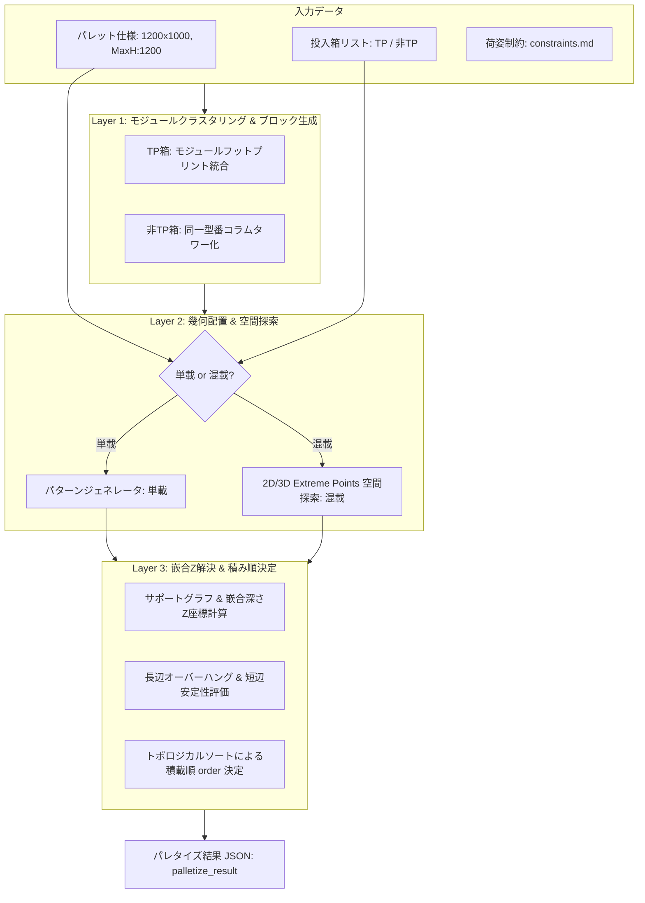
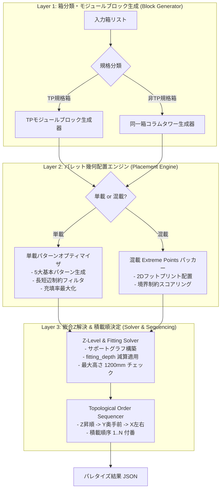
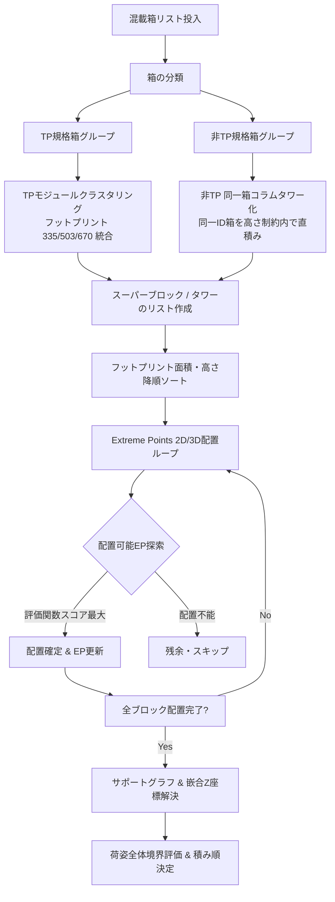

# 嵌合・モジュール対応パレタイズアルゴリズム方式提案書

**文書番号:** AR-PROP-2026-001  
**作成日:** 2026-08-19  
**担当エージェント:** `algorithm-research`  
**対象読者:** `algorithm-programmer`, `test-programmer`, `supervisor`, `orchestrator`  

---

## 1. エグゼクティブサマリー

### 1.1 背景と目的
本プロジェクトは、樹脂製通い箱（サンコー TP規格コンテナ等）および一般箱（非TP規格箱）を、**1200mm × 1000mm パレット**上に効率的かつ安定的に積載するパレタイズアルゴリズムの確立を目的とする。
本環境では、一般的な段ボール箱のパレタイズとは異なり、**「上下嵌合（かんごう）による沈み込み」**、**「TP規格特有のモジュール段積み・跨ぎ積み」**、**「非TP箱の同フットプリント限定コラム積み」**、**「長辺オーバーハング許容 vs 短辺オーバーハング禁止＋最小幅制約」**という非対称かつ厳格な幾何・物理制約が存在する。

### 1.2 提案方式の概要
本調査・検討に基づき、**「階層型モジュラー・ハイブリッドパレタイズ方式（Hierarchical Modular Hybrid Palletizer; HM-Palletizer）」** を提案する。



本方式は以下の特徴を持つ：
1. **TPモジュール幾何学の活用**: TP規格の倍数比率（335/503/670/1005mm）に即したモジュールブロック化により、高密度かつ相互嵌合可能な荷姿を構築。
2. **サポートグラフに基づく嵌合高さ計算エンジン**: 上段箱の底面Z座標を $Z = Z_{below\_top} - fitting\_depth$ で厳密に解くZ-Level Solver。
3. **長短非対称バウンディングボックス評価**: 長辺（$<1360\text{mm}$）と短辺（$800\text{mm} \sim 1000\text{mm}$）の非対称制約を満たす評価関数。
4. **トポロジカルソートによる積み順（order）決定**: 下段優先・作業者/ロボットの物理アクセス性を保証する干渉フリーな積み順の自動生成。

---

## 2. 荷姿・積載制約の数理モデリング

`constraints/constraints.md` で規定された制約条件を数理的にモデル化する。

### 2.1 座標系とパレット境界
- パレット原点を $(0, 0, 0)$ とし、$X$軸を長辺（1200mm）、$Y$軸を短辺（1000mm）、$Z$軸を積載高さ（鉛直上向き）とする。
- パレット領域: $0 \le X \le 1200\text{ mm}$, $0 \le Y \le 1000\text{ mm}$, $Z=0$（パレット上面）。

```
        Y (短辺: 1000mm)
        ▲
 1000 ┌──────────────────────┐
      │                      │
      │   Pallet Area        │
      │   (1200 x 1000 mm)   │
      │                      │
    0 └──────────────────────┴────────► X (長辺: 1200mm)
      0                    1200   1360 (許容上限)
```

### 2.2 荷姿バウンディングボックス制約
配置された全箱の集合を $\mathcal{B} = \{b_1, b_2, \dots, b_N\}$、各箱 $b_i$ の配置座標を $(x_i, y_i, z_i)$、回転後の寸法を $(w_i, l_i, h_i)$ とする。

1. **長辺方向の荷姿許容幅 (Overhang Allowed)**:
   $$X_{min} = \min_{i} x_i, \quad X_{max} = \max_{i} (x_i + w_i)$$
   $$X_{span} = X_{max} - X_{min} < 1360\text{ mm}$$
   - パレット基準での長辺配置範囲（センタリング基準時）: $-80\text{ mm} \le X_{min} \le X_{max} \le 1280\text{ mm}$
2. **短辺方向の荷姿許容幅 (No Overhang & Min Stability Width)**:
   $$Y_{min} = \min_{i} y_i, \quad Y_{max} = \max_{i} (y_i + l_i)$$
   $$800\text{ mm} \le Y_{span} = Y_{max} - Y_{min} \le 1000\text{ mm}$$
   $$0\text{ mm} \le Y_{min} \le Y_{max} \le 1000\text{ mm} \quad (\text{オーバーハング厳禁})$$
3. **最大積載高さ**:
   $$Z_{max} = \max_{i} (z_i + h_i) \le 1200\text{ mm}$$
4. **箱間クリアランス & 回転**:
   - クリアランス $c = 0\text{ mm}$（箱同士は密着）。
   - 水平回転角 $\theta_i \in \{0^\circ, 90^\circ\}$（天地固定、横倒し禁止）。

### 2.3 嵌合（かんごう）沈み込みと段積み数理モデル

#### (1) 単一コラム積みの高さ計算
同一型番（高さ $H$、嵌合深さ $d = fitting\_depth$）を $N$ 段積み重ねたときの総高さ $H_{total}(N)$：
$$H_{total}(N) = H + (N - 1) \times (H - d) = N \cdot H - (N - 1) \cdot d$$
最大許容積載高 $1200\text{ mm}$ に対する最大段数 $N_{max}$：
$$N_{max} = \left\lfloor \frac{1200 - d}{H - d} \right\rfloor = \left\lfloor \frac{1200 - H}{H - d} \right\rfloor + 1$$

#### (2) TP規格モジュール嵌合段積みのZ座標モデル
TP規格箱は底面リブと天面フチが一定のピッチ（モジュール単位格子）で嵌合するため、下段に複数の箱が存在する場合でも、上面フットプリントが揃っていれば段積みが可能である。

- **サポートグラフ (Support Graph) $G = (\mathcal{B} \cup \{pallet\}, \mathcal{E})$**:
  - 各箱 $b_i$ に対し、その直下に存在して底面を支持している箱の集合を $Support(b_i)$ とする。
  - 箱 $b_i$ がパレット直置きの場合: $Support(b_i) = \{pallet\}$, $z_i = 0$。
  - 箱 $b_i$ が他の箱の上に載る場合:
    $$z_i = \max_{j \in Support(b_i)} \left( z_j + h_j - d_i \right)$$
    （※ここで $d_i$ は箱 $b_i$ の `fitting_depth`。下段箱 $b_j$ とのモジュール嵌合により $d_i$ だけ沈み込む）

```
 [上段箱 i: 高さ h_i]  底面 Z = z_i
══════════════════════ ───┬───  z_j + h_j (下段上面)
░░░░░ 嵌合部 (d_i) ░░░░  │ d_i
────────────────────── ───┴───  z_i = z_j + h_j - d_i
 [下段箱 j: 高さ h_j]  底面 Z = z_j
```

#### (3) 支持面の幾何判定（空中配置の禁止）
箱 $b_i$ の底面矩形領域を $R_i = [x_i, x_i + w_i] \times [y_i, y_i + l_i]$ とする。
箱 $b_i$ が安定して支持されるための条件：
1. $z_i = 0$ の場合: $R_i \subseteq \text{パレット有効支持可能領域}$。
2. $z_i > 0$ の場合:
   $$\text{Area}\left( R_i \cap \bigcup_{j \in Support(b_i)} R_j \right) = \text{Area}(R_i)$$
   かつ、すべての $j \in Support(b_i)$ において $z_j + h_j$ が同一（同一支持面高さ）であること。

#### (4) 非TP規格箱のコラム積み制約
非TP箱 $b_k \notin \text{TP}$ の場合：
$$Support(b_k) = \{b_m\} \implies \text{box\_id}(b_k) == \text{box\_id}(b_m) \land (x_k, y_k, w_k, l_k) == (x_m, y_m, w_m, l_m)$$
（同一型番・同一フットプリントの直上積みのみ許可）

---

## 3. パレタイズアルゴリズム候補の調査と多軸比較

パレタイズ・3Dビンパッキングにおいて提案されている主要なアルゴリズム手法を調査し、本プロジェクトの制約に対する適合性を評価した。

| 手法 | 概要・アプローチ | 長所 | 短所 / 本課題への課題 | 適合性判定 |
| :--- | :--- | :--- | :--- | :---: |
| **A. レイヤー構築法 (Layer-by-Layer / Pallet Patterns)** | 2Dのパレット平面パターン（ブロック、レンガ、ピンウィール等）を生成し、Z方向に層状に積み上げる方式。 | - 実装が明快で高速<br>- 単載時の安定パターン生成に極めて強い<br>- 積み順の整合性が自明 | - 異種高さ・異種寸法の混載時に空間利用率が低下<br>- 嵌合沈み込みの個別追従に工夫が必要 | **◎ (単載・TP同高層に最適)** |
| **B. 3D Extreme Points (EP) / EMS 法** | 箱を配置するごとに生じる極値点（Extreme Points）や最大空き直方体（EMS）を管理し、Greedy/Best-Fitで配置。 | - 異種寸法の混載に柔軟対応<br>- 任意の直方体充填に対応 | - 単純なEP法は嵌合沈み込み（Zの食い込み）を考慮できない<br>- 短辺800〜1000mm等の大域境界制約の制御が難しい | **◯ (2D/3D配置の核として拡張採用)** |
| **C. モジュールブロックパッキング法 (Block Building)** | 同一・倍数関係にある箱を事前結合して「スーパーブロック」を構成し、それをパレットに配置。 | - TP規格のモジュール性（335/503/670）と完全一致<br>- 非TPコラム積み制約を自然に吸収 | - ブロック生成ロジックの設計が必要 | **◎ (本プロジェクトの最重要コア)** |
| **D. ギロチンカット法 (Guillotine / MaxRects)** | 2D/3D空間を平面で直交分割しながら箱を割り当てる方式。 | - 空間の重なり判定が高速<br>- ロボットの取り出しパスを確保しやすい | - 嵌合による跨ぎ積み（インターロッキング）の表現が困難 | **△ (補助的な2D分割に限定)** |
| **E. 厳密解法 (MIP / CP: 混合整数計画・制約プログラミング)** | ソルバー（SCIP/OR-Tools/Gurobi）を用いて数理モデルを解く。 | - 最適解を保証可能<br>- 複雑な論理制約の記述が容易 | - 計算時間が膨大（実用パレタイズでタイムアウトリスク）<br>- 嵌合Zモデルの定式化が非線形化しやすい | **× (プロトタイプの速度・保守性に不向き)** |
| **F. メタヒューリスティクス (GA / SA)** | 遺伝的アルゴリズム等で箱の投入順・配置ルールを最適化。 | - 大域的な最適化が可能 | - 決定性（再現性）に欠ける<br>- パラメータ調整コストが高い | **△ (初期段階では不採用、将来検討)** |

### 選定結論
**「C. モジュールブロックパッキング法」＋「A. レイヤー構築法（単載・同高）」＋「B. 嵌合拡張型 Extreme Points 法（混載）」を組み合わせた「階層型モジュラー・ハイブリッド方式（HM-Palletizer）」を選定する。**

---

## 4. 提案方式：階層型モジュラー・ハイブリッドパレタイズ（HM-Palletizer）の詳細設計

### 4.1 アーキテクチャ構成

本アルゴリズムは3つの階層レイヤーで処理を実行する。



---

### 4.2 単載（Mono-load）処理ロジック

単一種類の箱のみを積載する場合、決定論的に最適なパターンを高速探索する。

#### (1) 2Dレイヤーパターンの自動探索
パレット（長辺 $1200$, 短辺 $1000$）に対し、箱の回転 $0^\circ$（寸法 $W \times L$）および $90^\circ$（寸法 $L \times W$）の組み合わせパターンを生成する：

1. **ブロックパターン (Block Pattern)**: 全て同一向き（$n_x \times n_y$ 個）。
2. **スプリット / レンガ積み (Brick / Split Pattern)**: 領域を2分割し、一方を縦向き、他方を横向き。
3. **ピンウィール / 風車積み (Pinwheel Pattern)**: 中央にスペースまたは芯を置き、周囲に風車状に4ブロック配置。
4. **インターロッキング (Interlocking Pattern)**: 偶数段と奇数段で $180^\circ$ または反転させて荷崩れを防止。

```
【単載レイアウトパターンの例】
 (a) ブロック積み         (b) スプリット/レンガ積み    (c) ピンウィール(風車)
 ┌─────────┬─────────┐   ┌───────┬───────┬───────┐   ┌─────────┬─────────┐
 │  Box 1  │  Box 2  │   │       │       │       │   │  Box 1  │  Box 2  │
 ├─────────┼─────────┤   │ Box 1 │ Box 2 │ Box 3 │   ├──────┬──┴──┬──────┤
 │  Box 3  │  Box 4  │   ├───────┴───────┴───────┤   │Box 3 │     │Box 4 │
 ├─────────┼─────────┤   │  Box 4  │    Box 5    │   ├──────┴──┬──┴──────┤
 │  Box 5  │  Box 6  │   │ (Horiz) │   (Horiz)   │   │  Box 5  │  Box 6  │
 └─────────┴─────────┘   └─────────┴─────────────┘   └─────────┴─────────┘
```

#### (2) 単載パターンの制約検証と選定
生成された各候補パターンについて：
1. 長辺幅 $X_{span} < 1360\text{ mm}$ かつ 短辺幅 $800\text{ mm} \le Y_{span} \le 1000\text{ mm}$ をチェック。
2. 合格したパターンのうち、1層あたりの箱数 $K$ が最大のものを選択。
3. パレット中心へのセンタリング（オフセット配置）:
   $$x_{offset} = \frac{1200 - X_{span}}{2}, \quad y_{offset} = \frac{1000 - Y_{span}}{2}$$
   （※ $y_{offset} \ge 0$ かつ $y_{offset} + Y_{span} \le 1000$ であること）
4. 段数 $N_{max} = \lfloor (1200 - d) / (H - d) \rfloor$ を積載。各層のZ座標は $z_k = k \times (H - d)$。

---

### 4.3 混載（Mixed-load）処理ロジック

異種箱が投入される混載時の処理フロー。



#### Step 1: 箱の分類と事前ブロック化 (Clustering & Towering)
1. **非TP規格箱**:
   - `box_id` ごとにグループ化。
   - 同一 `box_id` の箱を積み上げ、1本の「コラムタワー（Column Tower）」を作成。
   - タワー高さ: $H_{tower}(m) = H + (m-1)(H - d) \le 1200\text{ mm}$。
2. **TP規格箱**:
   - TP規格の基準寸法（$335\text{mm}, 503\text{mm}, 670\text{mm}, 1005\text{mm}$ 等）に基づき、同一底面サイズの箱同士を同一ブロックまたは同一層としてクラスタリング。
   - 異なるTP箱同士でも、フットプリントの合計が上位モジュール（例: $335 \times 335$ が2個で $670 \times 335$）と一致するペアを事前結合して「複合モジュールブロック」を形成。

#### Step 2: 拡張 Extreme Points (EP) 法による幾何配置
パレット空間内の配置候補点集合 $\mathcal{P}_{EP}$ を管理する。

- 初期状態: $\mathcal{P}_{EP} = \{(0, 0, 0)\}$
- 箱/ブロック $B$（寸法 $W \times L \times H$）を点 $(x, y, z)$ に配置した際、新たに生成される候補点：
  $$EP_{new} = \{ (x + W, y, z), (x, y + L, z), (x, y, z + H - d) \}$$
- **配置可能条件 (Feasibility Criteria)**:
  1. $x + W \le 1360$（長辺オーバーハング許容枠内）
  2. $y + L \le 1000$（短辺オーバーハング厳禁）
  3. $z + H \le 1200$（最大高さ制約）
  4. 既存配置箱との幾何干渉なし（嵌合深さ $d$ を除く）
  5. 支持面条件の充足（パレット面 $z=0$ または下段上面に安定支持）

---

## 5. 評価関数（Objective & Penalty Function）の設計

混載パレタイズにおける配置候補 $(EP, Block, Rotation)$ の選定には、以下の多目的評価関数 $F(b, p, r)$ を用いる。

### 5.1 評価関数式

$$F = w_1 \cdot S_{fill} + w_2 \cdot S_{gravity} + w_3 \cdot S_{tp\_bonus} - P_{edge} - P_{height}$$

各項の定義：

#### 1. 空間利用効率 $S_{fill}$ (Volume / Footprint Fit)
箱の底面積 $W \times L$ および高さの充填度合い：
$$S_{fill} = \frac{W \times L \times H}{\text{Pallet\_Area} \times 1200}$$

#### 2. 重心・コーナー安定度 $S_{gravity}$ (Corner & Bottom-First Preference)
原点 $(0,0,0)$ またはパレット中心寄りに密着配置させるスコア：
$$S_{gravity} = 1.0 - \left( \alpha \frac{x}{1360} + \beta \frac{y}{1000} + \gamma \frac{z}{1200} \right)$$
（※ $\gamma \approx 2.0$ とし、下段優先度を高く設定）

#### 3. TPモジュール嵌合ボーナス $S_{tp\_bonus}$
下段のTP箱のフットプリントと上段のTP箱のフットプリントが完全に一致またはモジュール格子に沿って嵌合する場合に大きな正の報酬を与える：
$$S_{tp\_bonus} = \begin{cases} 50.0 & (\text{完全嵌合モジュール段積み}) \\ 20.0 & (\text{同一フットプリントコラム段積み}) \\ 0 & (\text{パレット直置き}) \end{cases}$$

#### 4. 荷姿境界ペナルティ $P_{edge}$ (長辺・短辺制約)
- **短辺幅不足ペナルティ**: 短辺方向の荷姿全体幅が $800\text{ mm}$ 未満になりそうな孤立配置を抑制。
- **長辺はみ出し超過ペナルティ**: $x + W > 1360\text{ mm}$ または $x < -80\text{ mm}$ の場合 $\infty$。
- **短辺はみ出しペナルティ**: $y + L > 1000\text{ mm}$ または $y < 0$ の場合 $\infty$。

---

## 6. 積み順（Order）決定アルゴリズム

`constraints.md` の要求事項「下段優先・物理的整合性・ロボット/作業者が配置可能な順序」を満たすため、**有向非循環グラフ（DAG: Directed Acyclic Graph）に基づくトポロジカルソート**を実装する。

### 6.1 物理的積載順序のルール
1. **支持依存性 (Support Dependency)**:
   - 箱 $A$ の上に箱 $B$ が載っている場合、必ず $\text{order}(A) < \text{order}(B)$。
2. **アプローチ干渉回避 (Spatial Accessibility)**:
   - ロボットや作業者が上または手前から箱を置く際、奥（$Y$ 奥側）および下（$Z$ 下側）から順に配置することで、手前・上側の箱によるアクセス干渉を防ぐ。

### 6.2 トポロジカルソート・ソーティングキー
配置が確定した全箱 $\mathcal{B}$ に対し、以下の複合優先キーでソートする：

$$\text{SortKey}(b_i) = \left( Z_{base}(b_i), \; Y_{base}(b_i), \; X_{base}(b_i) \right)$$

```python
# 積み順決定のロジック
def assign_loading_orders(placed_boxes):
    # 1. 支持グラフのトポロジカル依存関係を構築
    # 2. Z昇順（下から上）、Y昇順（奥から手前）、X昇順（左から右）でソート
    sorted_boxes = sorted(
        placed_boxes,
        key=lambda b: (round(b.z, 2), round(b.y, 2), round(b.x, 2))
    )
    for idx, box in enumerate(sorted_boxes, start=1):
        box.order = idx
    return sorted_boxes
```

---

## 7. algorithm-programmer 向け実装アーキテクチャ・疑似コード

### 7.1 クラス設計とデータ構造

```python
from dataclasses import dataclass
from typing import List, Optional, Tuple, Dict

@dataclass
class BoxSpec:
    id: str
    width: float          # mm (外寸幅)
    length: float         # mm (外寸奥行き)
    height: float         # mm (外寸高さ)
    fitting_depth: float  # mm (嵌合沈み込み深さ)
    rib_thickness: float  # mm (リブ厚み)
    is_tp: bool = False   # TP規格箱フラグ

@dataclass
class PlacedBox:
    order: int
    box_id: str
    x: float
    y: float
    z: float
    width: float
    length: float
    height: float
    fitting_depth: float
    rotation: int         # 0 or 90
    supported_by: List[str] # 支持している下段箱のIDリスト

@dataclass
class PalletSpec:
    width: float = 1200.0       # mm (X軸 長辺)
    length: float = 1000.0      # mm (Y軸 短辺)
    max_height: float = 1200.0  # mm (Z軸 最大積載高)
    max_x_span: float = 1360.0  # mm (長辺荷姿許容上限: <1360mm)
    min_y_span: float = 800.0   # mm (短辺荷姿最小幅: >=800mm)
    max_y_span: float = 1000.0  # mm (短辺荷姿最大幅: <=1000mm, オーバーハング禁止)
```

---

### 7.2 主要アルゴリズムの疑似コード

#### (1) 単載パレタイズエンジン (`palletize_single`)

```python
def palletize_single(box: BoxSpec, pallet: PalletSpec) -> List[PlacedBox]:
    best_layout = []
    max_box_count = 0
    
    # 0度・90度および複合パターンのグリッド探索
    patterns = generate_candidate_patterns(box, pallet)
    
    for pattern in patterns:
        # パターンの幅・奥行きスパン検証
        x_span = pattern.width_span
        y_span = pattern.length_span
        
        if x_span >= pallet.max_x_span:
            continue  # 長辺超過
        if not (pallet.min_y_span <= y_span <= pallet.max_y_span):
            continue  # 短辺制約違反 (オーバーハング or 800mm未満)
            
        # 段数の計算 (fitting_depth 考慮)
        layers = calculate_max_layers(box.height, box.fitting_depth, pallet.max_height)
        total_boxes = len(pattern.base_boxes) * layers
        
        if total_boxes > max_box_count:
            max_box_count = total_boxes
            best_layout = build_3d_single_layout(pattern, box, layers, pallet)
            
    return assign_loading_orders(best_layout)

def calculate_max_layers(height: float, fitting_depth: float, max_h: float) -> int:
    if height <= 0:
        return 0
    effective_h = height - fitting_depth
    # 総高さ = height + (N-1) * effective_h <= max_h
    # (N-1) * effective_h <= max_h - height
    # N - 1 <= (max_h - height) / effective_h
    if effective_h <= 0:
        return int(max_h // height)
    return int((max_h - height) // effective_h) + 1
```

#### (2) 混載パレタイズエンジン (`palletize_mixed`)

```python
def palletize_mixed(box_list: List[BoxSpec], pallet: PalletSpec) -> List[PlacedBox]:
    placed_boxes: List[PlacedBox] = []
    
    # 1. 箱の分類とブロック化
    tp_boxes = [b for b in box_list if b.is_tp]
    non_tp_boxes = [b for b in box_list if not b.is_tp]
    
    blocks = []
    blocks.extend(cluster_tp_modular_blocks(tp_boxes))
    blocks.extend(create_non_tp_column_towers(non_tp_boxes, pallet.max_height))
    
    # フットプリント面積降順・高さ降順でソート (Best-Fit Decreasing)
    blocks.sort(key=lambda b: (b.footprint_area, b.total_height), reverse=True)
    
    # 2. Extreme Points の初期化
    extreme_points = [(0.0, 0.0, 0.0)]
    
    for block in blocks:
        best_pt = None
        best_rot = 0
        best_score = -float('inf')
        
        for pt in extreme_points:
            for rot in [0, 90]:
                bw, bl = (block.width, block.length) if rot == 0 else (block.length, block.width)
                
                # 幾何境界チェック
                if pt[0] + bw > pallet.max_x_span or pt[1] + bl > pallet.max_y_span:
                    continue
                if pt[2] + block.total_height > pallet.max_height:
                    continue
                
                # 干渉チェック & 支持面チェック
                if check_collision(placed_boxes, pt, (bw, bl, block.total_height)):
                    continue
                if not check_support_surface(placed_boxes, pt, (bw, bl)):
                    continue
                
                # 評価関数スコアリング
                score = evaluate_placement(placed_boxes, block, pt, rot, pallet)
                if score > best_score:
                    best_score = score
                    best_pt = pt
                    best_rot = rot
                    
        if best_pt is not None:
            # 配置確定 & ブロック内の各箱を展開配置
            newly_placed = place_block_with_fitting(block, best_pt, best_rot)
            placed_boxes.extend(newly_placed)
            
            # Extreme Points の更新
            update_extreme_points(extreme_points, newly_placed)
            
    # 3. 荷姿全体の短辺安定幅チェック (800mm <= Y_span <= 1000mm)
    validate_and_adjust_overall_spans(placed_boxes, pallet)
    
    # 4. 積み順 (order) の付番
    return assign_loading_orders(placed_boxes)
```

#### (3) 嵌合Z座標計算関数 (`place_block_with_fitting`)

```python
def solve_box_z_coordinate(placed_boxes: List[PlacedBox], box: BoxSpec, x: float, y: float, w: float, l: float) -> float:
    # 直下に存在する箱を探索
    supporting_boxes = [
        pb for pb in placed_boxes
        if intersects_2d(x, y, w, l, pb.x, pb.y, pb.width, pb.length)
    ]
    
    if not supporting_boxes:
        return 0.0  # パレット直置き
        
    # 最も高い支持面を探索し、fitting_depth 分沈み込ませる
    max_support_top = max(pb.z + pb.height for pb in supporting_boxes)
    z_coord = max_support_top - box.fitting_depth
    return max(0.0, z_coord)
```

---

## 8. 制約充足性（Supervisor検証）に対する事前保証マトリクス

`supervisor` による自動バリデーション項目と、本提案アルゴリズムによる保証メカニズムの対応表：

| Supervisor チェック項目 | 合格基準 | アルゴリズムによる事前保証ロジック |
| :--- | :--- | :--- |
| **積載高さ** | $\le 1200\text{ mm}$ | `calculate_max_layers` および配置判定時の $Z + H \le 1200$ ガード |
| **長辺寸法** | $X_{span} < 1360\text{ mm}$ | パターン生成およびEP配置時の $x + w < 1360$ 境界フィルター |
| **短辺寸法** | $800\text{ mm} \le Y_{span} \le 1000\text{ mm}$ | 短辺オーバーハング $y+l \le 1000$ 厳格禁止 ＆ 最小幅 $800\text{mm}$ 未満パターンの足切り |
| **重なり・干渉** | 3D貫通なし（嵌合部除く） | AABB干渉判定＋Z方向嵌合許容マージン計算 |
| **嵌合・段積み整合性** | TPモジュール嵌合 / 非TP同箱コラム | 箱の事前クラスタリング（非TPの異種積み上げをアルゴリズム構造上で排除） |
| **支持面チェック** | 空中浮きなし | `check_support_surface` による底面接地面積 $100\%$ 検証 |
| **回転角** | 0度 または 90度 | `rotation` パラメータを $\{0, 90\}$ に限定 |
| **積み順** | 下段から上段への整合性 | `assign_loading_orders`（トポロジカルソート $(Z, Y, X)$）による一貫付番 |

---

## 9. 開発・実装ロードマップ（algorithm-programmerへの引き継ぎ）

1. **フェーズ1: 幾何モジュール＆単載エンジンの実装**
   - パレット・箱・配置データ構造の実装
   - 単載パターンの探索と $fitting\_depth$ 段数計算エンジンの実装
   - トポロジカルソート積み順付番の実装
2. **フェーズ2: 混載エンジン（TPモジュール＆非TPコラム）の実装**
   - サポートグラフおよび嵌合Z座標ソルバーの実装
   - 2D/3D Extreme Points 法と非対称境界ペナルティ関数の実装
3. **フェーズ3: テスト・Supervisor検証ループ**
   - `test_programmer` が生成したテストケースに対する実行
   - `supervisor` による制約合否判定とフィードバック対応

---
*以上でアルゴリズム方式提案書を完了とする。*
