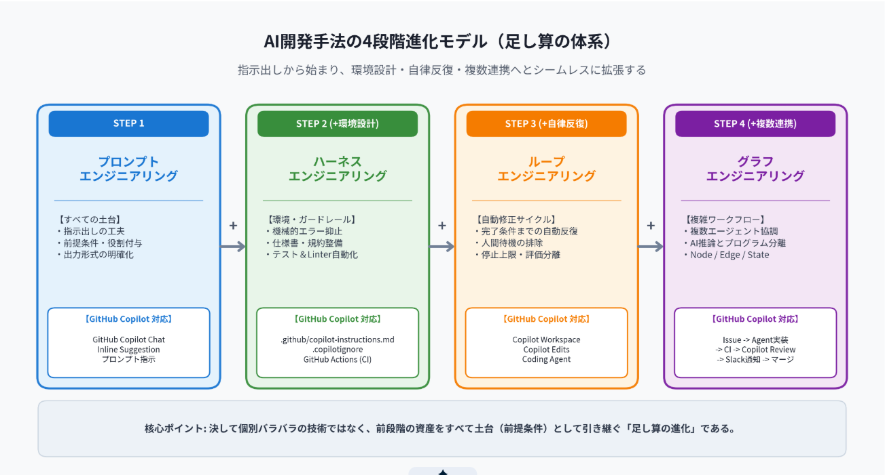
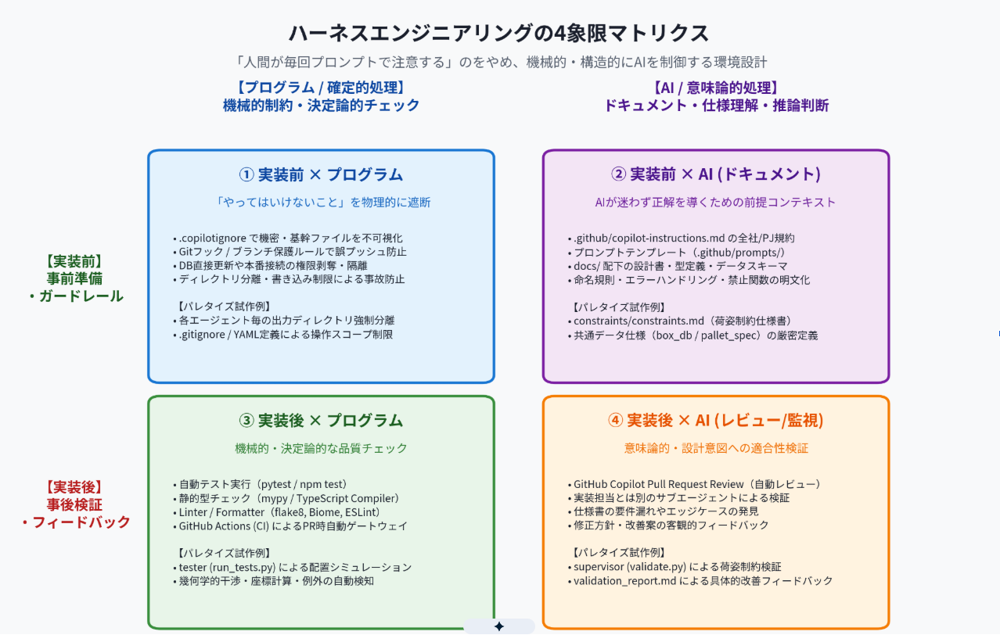

# **AI開発手法の体系化とGitHub Copilot実践ガイド**

### ---

**〜プロンプトからハーネス・ループ・グラフへの進化とパレタイズ試作プロジェクトへの適用〜**

**作成日:** 2026年9月20日

**対象読者:** 社内エンジニア、制御・生産技術開発部門、プロジェクト管理者

**目的:** AI駆動型開発の最新パラダイム（プロンプト・ハーネス・ループ・グラフ）を理解し、社内標準ツールであるGitHub Copilotを用いた実務展開および実案件（パレタイズアルゴリズム試作）への適用指針を共有する。

\---

## **1\. エグゼクティブサマリー（背景と目的）**

近年、生成AIを活用したソフトウェア開発は、「チャット画面に自然言語でプロンプトを入力してコードを出力させる」という単発の利用法から、開発環境全体を設計・整備し、AIを安全かつ自律的に駆動させる高度なエンジニアリングへと急速にシフトしています。

特に現場での実務においては、**「AIが生成したコードに毎回手動で不具合を指摘する往復作業（プロンプト疲れ）」**や、**「複雑な仕様・制約条件を単一のプロンプトでは表現しきれずに破綻する」**といった課題が顕在化しています。

本ドキュメントは、YouTube動画 [【今さら聞けない...】ハーネス・ループ・グラフ・エンジニアリングを完全解説！｜Codex | Claude Code](https://youtu.be/Bj5_pnb8cnk) で提示された最新の体系論をベースに、以下の3点を明らかにすることを目的としています。

> 1. **AI開発手法の4段階進化モデルの理解**：プロンプト、ハーネス、ループ、グラフエンジニアリングの定義、役割、および「足し算の体系」としての相互関係を整理する。  
> 2. **GitHub Copilot エコシステムへのマッピング**：先行ツール（Claude Code等）で実証されたアプローチを、社内標準の開発環境であるGitHub Copilotに置き換えて実践するための構成要素を具体化する。  
> 3. **社内実案件（パレタイズアルゴリズム試作）への適用**：当社で推進中の「箱パレタイズ（嵌合・リブ付き空箱）アルゴリズムおよび評価基盤開発」を題材に、マルチエージェント協調・自律改善ループの設計を分析し、社内発表用スライドの骨子を策定する。

\---

## **2\. AI開発手法の4段階進化モデル（足し算の体系）**

AI関連の用語は急速に増加していますが、これらは決して個別バラバラの独立した技術ではありません。「前の段階で構築した資産を前提（土台）として引き継ぎながら拡張していく、一本の足し算の進化モデル」として捉えることができます。

図1: AI開発手法の4段階進化モデル（指示出しから環境設計、自律反復、複数連携への拡張）

### **各進化段階の概念と本質**

#### **① プロンプトエンジニアリング（Prompt Engineering）: 【すべての土台】**

> * **概要:** AIに対する自然言語の指示文を工夫し、期待する精度のアウトプットを引き出す技術。  
> * **主要要素:** 役割付与（ロール設定）、前提条件・制約事項の提示、出力形式の固定（JSON、Markdown、特定言語の構文指定）、思考プロセスの誘導（Chain-of-Thought）。  
> * **位置づけ:** 後続のハーネスやループ、グラフに進んでも不要になることはなく、すべてのサブタスクの基本指示書として常に機能し続けます。

#### **② ハーネスエンジニアリング（Harness Engineering）: 【環境・ガードレールの設計】**

> * **概要:** AIエージェントが動作する「周囲の環境、利用可能なツール、制約、検証機構」を包括的に設計・整備する技術。  
> * **目的:** AIの出力ミスに対して**人間が毎回手動でプロンプトを打ち直すのをやめる**こと。誤った出力を機械的・構造的に未然防止・自動検知する環境を作ります。  
> * **本質:** 「AIに何を言わせるか（プロンプト）」ではなく、「AIが何を参照し、何ができて何ができないか（環境・ハーネス）」を統制することに主眼があります。

#### **③ ループエンジニアリング（Loop Engineering）: 【自律反復・修正サイクル】**

> * **概要:** ハーネスで整えられた環境下で、人間が毎回指示を打たなくても、完了条件を満たすまでAI自身が「タスク実行 → 検証 → 修正」を自律的に繰り返す仕組み。  
> * **目的:** AIの実装完了を人間が待つアイドルタイムをゼロにし、人間の役割を「都度の指示打ち」から「ループの設計と最終検証」へシフトさせること。  
> * **重要ポイント:**  
  * **停止上限（安全弁）の必須化:** 完了条件を満たせない場合に無限ループやAPIコスト爆発に陥らないよう、最大ターン数（例: 20ターン）などの強制終了条件を必ず設定する。  
  * **評価主体の分離:** AI自身に自己採点させると判定が甘くなるため、合否判定は決定論的なテストコードや、独立した監査用サブエージェントに任せる。  
  * **適切な実装粒度:** 1ループでアプリ全体を作ろうとせず、「1機能単位」（人間が2〜3時間で実装する規模感）を1ループの単位とする。

#### **④ グラフエンジニアリング（Graph Engineering）: 【複数連携・ワークフロー最適化】**

> * **概要:** 異なる強みを持つAIモデル、外部ツール、従来の決定論的プログラムを有向グラフ（DAG）状に組み合わせ、複雑な業務パイプラインを自動化する技術。  
> * **主要概念:**  
  * **Node（ノード）:** 個別の作業単位（要件定義、コード実装、レビュー、テスト実行、通知など）。  
  * **Edge（エッジ）:** ノード間の遷移条件や進路（OKなら次へ、NGなら前へ差し戻しなど）。  
  * **State（ステート）:** ノード間を受け渡される共通データ（仕様書、ソースコード、テスト結果、制約定義など）。  
> * **本質:** 「何でもAIにやらせるのではない」という役割分担の最適化。Slack通知やDB操作、テスト実行などの定型処理は確実な通常プログラムに任せ、推論や設計解釈が必要な箇所のみをAIエージェントに分担させます。

\---

## **3\. ハーネスエンジニアリングの深掘り：4象限マトリクス**

ハーネスエンジニアリングが対象とする範囲は非常に多岐にわたります。これらは**「実行タイミング（実装前 / 実装後）」**と**「処理主体（プログラム / AI）」**の2軸で整理される4象限マトリクスとして明確に分類できます。

図2: ハーネスエンジニアリングの4象限マトリクス（事前/事後 × プログラム/AI）

| 区分 | 【プログラム / 確定的処理】 （機械的制約・決定論的チェック） | 【AI / 意味論的処理】 （ドキュメント・仕様理解・推論判断）&nbsp;&nbsp; |
| :---- | :---- | :---- |
| **【実装前】 事前準備・ガードレール** | **① 実装前 × プログラム（物理的アクセス制御）** 「やってはいけない操作」をAIが実行する前に機械的に遮断する。 • .copilotignore による機密・基幹ファイルの不可視化 • Git Pre-commit フック / ブランチ保護ルール • 本番データベース書き込み権限の完全剥奪・環境分離 • サブエージェントごとの作業ディレクトリ分離 | **② 実装前 × AI（仕様・ドキュメント基盤）** AIが迷わず正しい設計・コードを導くための前提コンテキストを提供する。 • .github/copilot-instructions.md（全社・PJ規約） • カスタムプロンプト（.github/prompts/\*.prompt.md） • docs/ 配下の設計書・型定義・データスキーマ • 命名規則、エラー処理原則、禁止関数の明文化 |
| **【実装後】 事後検証・フィードバック** | **③ 実装後 × プログラム（決定論的チェック）** 実装されたコードが最低限の品質基準を満たしているかを機械的に自動検証する。 • 自動単体テスト実行（pytest, npm test 等） • 静的型チェック（mypy, TypeScript Compiler） • Linter / Formatter（flake8, Biome, ESLint） • GitHub Actions (CI) によるコミット/PR時自動ゲートウェイ | **④ 実装後 × AI（意味論的レビュー・監視）** 機械的テストでは測れない「設計意図との整合性」や「エッジケースの考慮」を別のAI視点で検証する。 • GitHub Copilot Pull Request Review（自動レビュー） • 実装担当とは独立したレビュー専用エージェントの配置 • 仕様書の要件漏れや業務制約違反の検出 • 修正方針・改善案の具体的フィードバック |

\---

## **4\. GitHub Copilot エコシステムへのマッピング**

先行ツール（Claude Code や Codex）の具体例を、社内標準の開発基盤である**GitHub Copilot エコシステム**に置き換えた対応関係です。

| 分類 | Claude Code / Codex での例 | GitHub Copilot エコシステムでの対応実装&nbsp;&nbsp; |
| :---- | :---- | :---- |
| **① プロンプト** | チャットプロンプト入力、役割設定 | **GitHub Copilot Chat**、**Inline Suggestion**、コメント駆動コード生成 |
| **② ハーネス （前×プログラム）** | Hooks設定、環境変数・権限制御 | **.copilotignore**（参照・変更禁止ファイルの明示的除外）、VS Code ワークスペース制限 |
| **② ハーネス （前×AI）** | CLAUDE.md, AGENTS.md | **.github/copilot-instructions.md**、カスタムプロンプト（.github/prompts/）、\#file / \#folder / @workspace コンテキスト参照 |
| **② ハーネス （後×プログラム）** | ローカルテスト、Linter | **GitHub Actions** による自動テスト（pytest等）・型チェック（mypy等）・Linter実行 |
| **② ハーネス （後×AI）** | サブエージェントによるコードレビュー | **GitHub Copilot in PR / Copilot Code Review** による自動差分レビュー・改善提案 |
| **③ ループ** | /goal コマンド、Auto mode、RALPH | **GitHub Copilot Workspace**（仕様策定→コード編集→テストの自律サイクル）、**Copilot Edits**（複数ファイル一括編集・ターミナルフィードバック連携）、**Copilot Coding Agent in Issues** |
| **④ グラフ** | Slack ➔ Codex ➔ Claude ➔ CI | **GitHub Issue ➔ Copilot Coding Agent ➔ GitHub Actions CI ➔ Copilot Code Review ➔ Slack通知 ➔ 人間マージ** の統合ワークフロー |

&nbsp;

**💡 GitHub Copilot 実践設定テンプレート**

**1\. .github/copilot-instructions.md（実装前 × AI）の定義例:**

\# プロジェクト共通開発ガイドライン  
\- 言語環境: Python 3.11+ / 型アノテーション（typing）を厳格に付与すること  
\- コーディング規約: PEP8準拠、flake8およびmypyでエラーゼロを維持すること  
\- テスト方針: 新規関数には必ずpytest用の単体テストを同梱すること  
\- 制約仕様: パレタイズ計算時は必ず constraints/constraints.md の幾何制約を順守すること  
\- エラーハンドリング: 例外を握りつぶさず、独自例外クラスで呼び出し元へ明確に通知すること

**2\. .copilotignore（実装前 × プログラム）の定義例:**

\# 機密情報および基幹設定の除外  
.env\*  
secrets/  
\*\*/\*\_credentials.\*  
\# 大規模バイナリ・キャッシュの除外  
build/  
dist/  
\*.pyc

\---

## **5\. 自社実例への適用：「パレタイズアルゴリズム試作」プロジェクト**

当社で推進中の「箱パレタイズ（嵌合・リブ付き空箱のパレタイズ）アルゴリズムおよび評価基盤開発」プロジェクトは、この4つの開発手法を網羅した非常に先進的なマルチエージェント・アーキテクチャを有しています。

![パレタイズ・マルチエージェントグラフ＆ループ構造図][image3]

図3: パレタイズアルゴリズム試作におけるマルチエージェント・グラフ＆自律ループ構造

[Googleドライブで高解像度画像を表示](https://drive.google.com/file/d/1SSUYGSJHJtoJsDxrnDjnV0dP2F-FBwTn/view?usp=drivesdk)

### **エージェント構成と役割分担**

本プロジェクトでは、単一のエージェントにすべてを任せるのではなく、責務を8つの専門サブエージェントに分割し、明確なデータ契約のもとで協調動作させています。

| エージェント名 | 役割・責務 | 入力・参照データ | 主な生成成果物（アーティファクト）&nbsp;&nbsp; |
| :---- | :---- | :---- | :---- |
| **orchestrator** | 全体統括管理者。計画立案、各サブエージェントへの作業指示、進捗・整合性管理。 | ユーザー要求、全フェーズ進捗 | プロジェクト管理指示、実行計画 |
| **box-research** | パレタイズ対象箱（通い箱等）の外寸、嵌合深さ、リブ厚みの調査とDB化。 | カタログ・仕様書 | box\_research/box\_db.json, ビューワ |
| **algorithm-research** | 嵌合・リブ構造を考慮可能なパレタイズ方式の学術・技術調査と提案。 | 学術論文、技術動向 | algorithm\_research/proposal.md |
| **test-programmer** | 単載・混載・段積み制限・境界値などの評価用テストケース群を生成。 | box\_db.json | test\_programmer/test\_cases/\*.json |
| **algorithm-programmer** | 提案方式に基づき嵌合パレタイズエンジン本体を実装・改良。 | 方式提案書、テストケース、改善指示 | algorithm\_programmer/palletizer.py, models.py |
| **visualizer** | パレタイズ結果（配置座標、回転、積み順）を3D/2Dで可視化するツール開発。 | パレタイズ結果JSON | visualizer/index.html, visualize.py |
| **tester** | テストケースを入力にアルゴリズムを実行し、荷山形成シミュレーションとエラー検知を担当。 | テストケース、パレタイズエンジン | tester/results/\*.json, 実行ログ |
| **supervisor** | constraints.md（荷姿制約）に基づき、嵌合ズレやリブ干渉を厳格にバリデーション。 | パレタイズ結果、constraints.md | supervisor/reports/validation\_report.md |

### **パレタイズ試作プロジェクトにおける4分類の完全マッピング**

#### **1\. プロンプトエンジニアリング**

> * .agent/\*.yaml に定義された各エージェントの詳細な指示定義。  
> * 「あなたはアルゴリズム調査の専門家である」「他ディレクトリのファイルを勝手に書き換えてはならない」などのペルソナ・境界条件の明確化。

#### **2\. ハーネスエンジニアリング**

> * **実装前 × プログラム:** エージェントごとにディレクトリ（box\_research/, algorithm\_programmer/, tester/ 等）を完全に分離し、Git管理下での成果物汚染を物理的に抑止。  
> * **実装前 × AI:** ユーザーと対話形式で策定した constraints/constraints.md（荷姿制約仕様書）および共通データ仕様（box\_db, pallet\_spec, palletize\_result）。AIはこれを共通の言語・制約として自律動作する。  
> * **実装後 × プログラム:** tester (run\_tests.py) による配置計算、幾何学的干渉チェック、例外発生の自動捕捉。  
> * **実装後 × AI:** supervisor (validate.py) による荷姿制約適合性の意味論的チェック。制約違反を検知した際の validation\_report.md 出力。

#### **3\. ループエンジニアリング**

> * **Phase 3の自律改善ループ:**  
  1. tester がシミュレーションを実行し、実行時エラーがあれば即座に algorithm-programmer に差し戻す。  
  2. 正常終了した場合、supervisor が constraints.md に基づき荷姿を検証。  
  3. 「2段目の嵌合位置が3mmズレている」「リブの干渉が発生している」などのNG事項を具体的にレポート化し、algorithm-programmer に修正指示を出す。  
  4. すべてのテストケースで「合格（OK）」が出るまで、この改善サイクルを自律的に繰り返す。  
> * **自己採点防止の徹底:** 実装者（algorithm-programmer）とは独立した監査者（supervisor）が評価を行うことで、品質の妥協を構造的に防いでいる。

#### **4\. グラフエンジニアリング**

> * Phase 1（要件定義）➔ Phase 2（実装・ツール）➔ Phase 3（検証ループ）のパイプライン全体が有向グラフ（Node/Edge/State）として成立している。  
> * 3D可視化ツール（visualizer）がグラフの独立ノードとして組み込まれており、人間が直感的に荷姿を確認できる観測性の高いアーキテクチャを実現している。

\---

## **6\. 社内発表・スライド化に向けた構成案（全10枚）**

本マスタードキュメントをベースに、社内の技術勉強会や開発検討会で発表するためのスライド構成案（10スライド構成）です。

| No. | スライドタイトル | キーメッセージ・解説ポイント | 推奨配置コンテンツ&nbsp;&nbsp; |
| :---- | :---- | :---- | :---- |
| **1** | AI開発手法の新標準：プロンプトからハーネス・ループ・グラフへ | 「AIにどう指示するか」から「AIをどう動かす環境を作るか」へ。 GitHub Copilotで実践する自律型開発の全貌。 | 表紙タイトル、発表者情報 |
| **2** | 現場の課題：「プロンプトを打つだけ」の限界 | 毎回人間がミスを指摘する「プロンプト疲れ」、複雑な物理制約を満たせない手戻りの多さを指摘。 | 現場の困りごと・対話型AIの限界図 |
| **3** | AI開発の4段階進化モデル 〜足し算の体系〜 | プロンプト・ハーネス・ループ・グラフは個別技術ではなく、前段階を土台とした積み上げである。 | **図1（4段階進化モデル図）** |
| **4** | ハーネスエンジニアリング：注意するのをやめる環境設計 | 「事前/事後 × プログラム/AI」の4象限マトリクスで、エラーを構造的に防ぐ仕組みを解説。 | **図2（4象限マトリクス図）** |
| **5** | 自律反復（ループ）とワークフロー（グラフ）の要諦 | 人間待機時間の排除、停止上限（安全弁）の重要性、定型コードとAI推論の適材適所な分担。 | ループ停止条件・グラフ概念図 |
| **6** | GitHub Copilot エコシステムへのマッピング | 先行エージェントの技術を社内環境でどう組むか？ .copilotignore、指示ファイル、GitHub Actions CI連携。 | Copilot機能対応表・設定コード例 |
| **7** | 自社実例：パレタイズアルゴリズム試作プロジェクト | 嵌合・リブ付き空箱パレタイズという高難度物理課題に対し、8つの専門エージェントを協調設計。 | **図3（パレタイズ・グラフ構造図）** |
| **8** | 実例に見る「ハーネス」と「自律ループ」の実装 | constraints.md による荷姿制約の事前定義、TesterとSupervisorによる自律合否判定サイクル。 | 制約仕様・バリデーションレポート例 |
| **9** | 導入効果：なぜグラフ構造なら複雑な課題が解けるのか | 巨大プロンプトの破綻を防ぎ、各エージェントの責任境界を分けることで得られた圧倒的な安定性・再現性。 | 3D可視化画面・アルゴリズム成果 |
| **10** | まとめと全社展開へのネクストアクション | 「ハーネス（仕様書・CI）」は一度作れば全社資産になる。 GitHub Copilotを活用した自律開発基盤の横展開へ。 | 今後のロードマップ・アクションプラン |

\---

## **7\. まとめ**

AIをソフトウェア開発に組み込む際の本質は、「AIにいかに流暢に喋らせるか」ではなく、**「AIが確実に正しい成果物を生み出せるよう、いかに強固な環境（ハーネス）と検証サイクル（ループ/グラフ）を周囲に設計できるか」**にあります。

社内の実案件である「パレタイズアルゴリズム試作」のアーキテクチャは、まさにその最先端の設計思想を具現化したモデルケースです。これをGitHub Copilotの各機能と適切に組み合わせることで、制御・生産技術からWebシステム開発に至るまで、幅広いプロジェクトで再現性の高いAI協調開発が実現できます。

